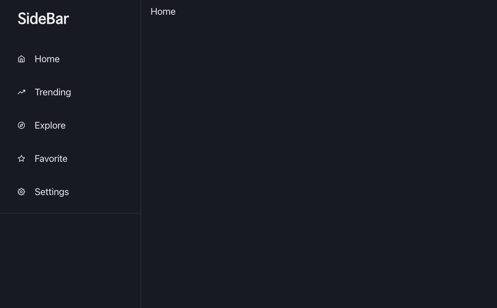
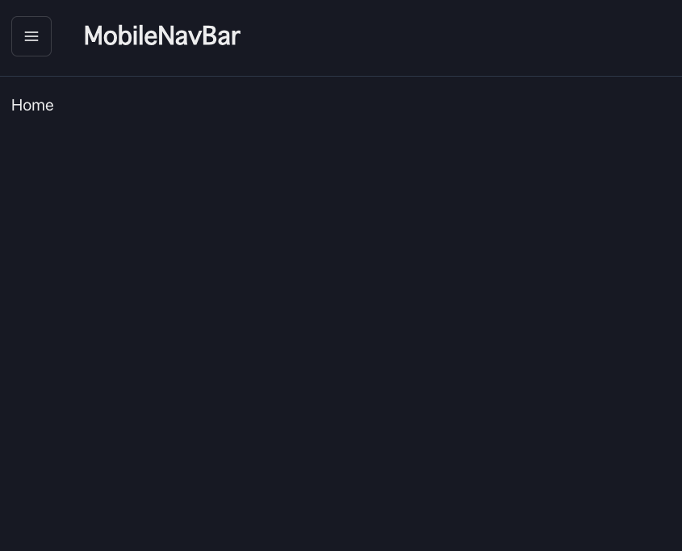
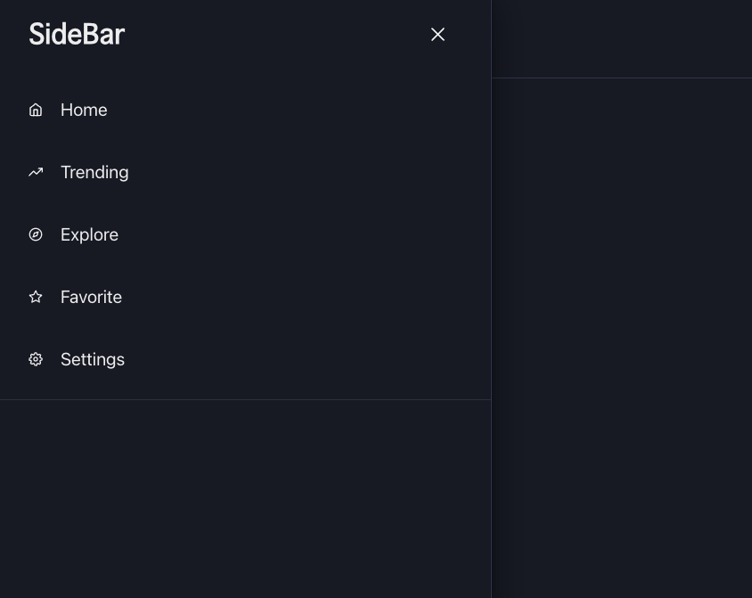

# Feedays_Web_Frontend
RSSリーダーサービスのWebフロントエンド（Next.js 13）
# 現在の実装状況
今はUIを実装するためにFigmaでデザインを作成しています
- Figmaでデザインが終わったら、コードを生成して実装していきます
- [x] インフラ層の実装
  - [x] バックエンドAPIのインターフェイスを実装してDIパターンでモックテストを実装
  - [ ] それをReduxに実装する

# 使用技術
- Next.js 13
- TypeScript
- ChakraUI
- 状態管理にReduxを採用

# スクリーンショット
## 解像度に応じて、サイドバー・ハンバーガメニューに切り替わる
### デスクトップ（サイドバー）

### モバイル（ハンバーガメニュー）

